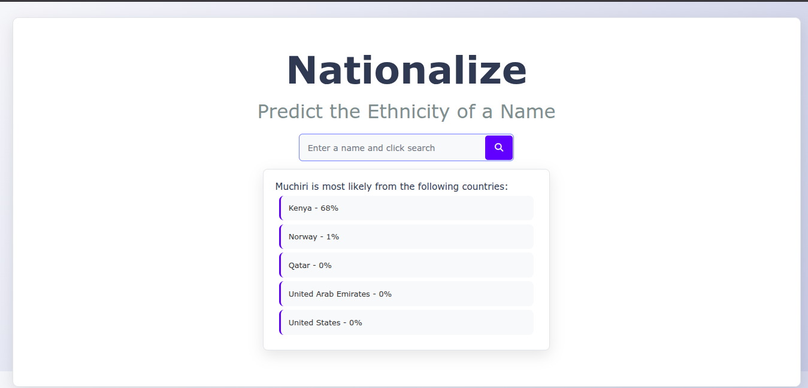

# Nationalize

Predict the likely nationality or ethnicity of a given name using the [Nationalize.io](https://nationalize.io/) API.

## Features
- Simple, modern UI
- Enter a name and get probable countries of origin with probabilities
- Responsive design
- Uses [Vite](https://vitejs.dev/) for fast development and build
- Clean, readable code with Prettier formatting

## Demo


## Getting Started

### Prerequisites
- [Node.js](https://nodejs.org/) (v16 or higher recommended)

### Installation
1. Clone the repository:
   ```bash
   git clone <repo-url>
   cd Nationalize
   ```
2. Install dependencies:
   ```bash
   npm install
   ```

### Running Locally
Start the development server:
```bash
npm run dev
```
Open your browser and go to the URL shown in the terminal (usually http://localhost:5173).

### Building for Production
To build the app for production:
```bash
npm run build
```
To preview the production build:
```bash
npm run preview
```

## Usage
1. Enter a name in the input field.
2. Click the search button (magnifying glass icon).
3. View the list of probable countries and their associated probabilities.

## Project Structure
- `index.html` – Main HTML file
- `main.js` – Application logic (fetches data from Nationalize.io and updates the UI)
- `style.css` – Styling for the app
- `public/` – Static assets (e.g., favicon)
- `package.json` – Project metadata and scripts

## Dependencies
- [Vite](https://vitejs.dev/) – Development/build tool
- [Prettier](https://prettier.io/) – Code formatter
- [Font Awesome](https://fontawesome.com/) – Icons (via CDN)

## API Reference
- [Nationalize.io API](https://nationalize.io/)
  - Example: `https://api.nationalize.io/?name=michael`

## License
This project is licensed under the MIT License.

---

*Made with ❤️ using Vite and the Nationalize.io API.*
